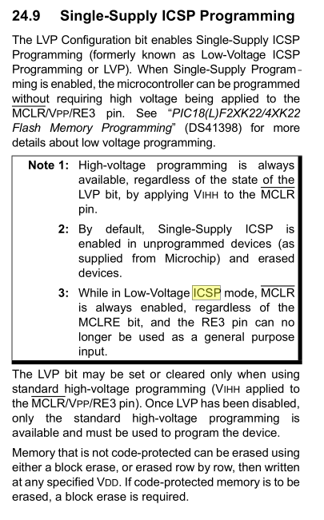

# Programing Setup

## Tools
[Microchip MPLAB](https://www.microchip.com/en-us/development-tools-tools-and-software/mplab-x-ide)
- Install 8-bit and 16-bit support.

[Code Configurator](https://www.microchip.com/en-us/development-tools-tools-and-software/embedded-software-center/mplab-code-configurator)

[XC Compilers](https://www.microchip.com/en-us/development-tools-tools-and-software/mplab-xc-compilers)

## TODO

- Select resistors for AC portions.
- Check AC portions will work with 3.3v.
- Add LED Controller. Assing LED pins.
- Check if capacitors needed on I2C.
- 

## Revisions

- v0.3 :
	Added Gesture Sensor.
	Switch to 3.3v supply. Modified resistors.
	Fix test_led. Added diode.
- v0.2 :
    Added LED time display.
	Added Buzzer.
	Added Test LED.
	Added Programing Header.
	Added 
- v0.1 :
    Added PIC.
	Added AC circuit.
	Added Power supply. Use 5v supply lines.
	Added Rest button.

## Device

[PIC18F26K22](../Datasheets/datasheet%20PIC18F26K22%20(microcontroller).pdf)
```
                                 ┌────┐__┌────┐
           PROG_EN  MCLR/VPP/RE3 ├  1      28 ┤ RB7/PGD  ICSP_DATA
                             RA0 ├  2      27 ┤ RB6/PGC  ICSP_CLK
                             RA1 ├  3      26 ┤ RB5
                             RA2 ├  4      25 ┤ RB4                ~BUZZER_EN
                             RA3 ├  5      24 ┤ RB3                 TEST_LED
                             RA4 ├  6      23 ┤ RB2      INT2 SDA2
                             RA5 ├  7      22 ┤ RB1      INT1 SCL2 
                             VSS ├  8      21 ┤ RB0      INT0
                             RA7 ├  9      20 ┤ VDD
                             RA6 ├ 10      19 ┤ VSS
                             RC0 ├ 11      18 ┤ RC7
                             RC1 ├ 12      17 ┤ RC6
                             RC2 ├ 13      16 ┤ RC5
                       SCL1  RC3 ├ 14      15 ┤ RC4      SDA1
                                 ╘════════════╛
                                  PIC18(L)F2XK22
Stats:
64K Bytes Flash
32768 Single Word Instructions
3896 Bytes SRAM
1024 Bytes EEPROM
25   I/O
19   10-bit A/D Channels
2    SPI
2    I2C
3    8-bit timers
4    16-bit timers


19 Free Pins. 167seg. 1 buzzer. 1 ac control. 1 sound.

with SPI 17 free pins. 
```


## Reset
Reset is done via the MCLR pin. Active low for reset. Can be toggled by MCLRE pin.

## In-Circuit Programing ICPS
Mode is PGC and PGD.
LVP bit must be enabled.

24.9 Single-Supply ICSP Programming.


See "Flash Memory Programming".

> The LVP bit may be set or cleared only when using standard high-voltage
> programming (VIHH applied to the MCLR/VPP/RE3 pin). Once LVP has been
> disabled, only the standard high-voltage programming is available and must
> be used to program the device.


## Compare Modules
Ref 14.2 Compare Mode in datasheet.
Compare mode lets us trigger and external event a set-time after 


